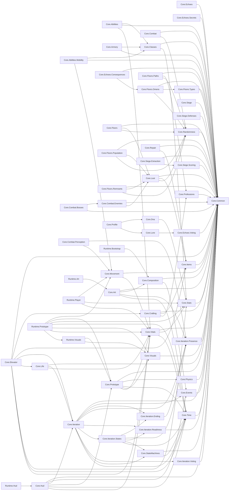

<!-- GENERADO por `python3 -m tools.arch`; no editar a mano. -->

# Grafo de dependencias (flecha = «usa a»)

```mermaid
flowchart LR
  n0["Core.Abilities"]; n1["Core.Abilities.Mobility"]; n2["Core.Armory"]; n3["Core.Art"]
  n4["Core.Classes"]; n5["Core.Combat"]; n6["Core.Combat.Bosses"]; n7["Core.Combat.Enemies"]
  n8["Core.Combat.Perception"]; n9["Core.Common"]; n10["Core.Composition"]; n11["Core.Crafting"]
  n12["Core.Dna"]; n13["Core.Echoes"]; n14["Core.Echoes.Consequences"]; n15["Core.Echoes.Secrets"]
  n16["Core.Echoes.Voting"]; n17["Core.Elevator"]; n18["Core.Events"]; n19["Core.Floors"]
  n20["Core.Floors.Omens"]; n21["Core.Floors.Paths"]; n22["Core.Floors.Population"]; n23["Core.Floors.Remnants"]
  n24["Core.Floors.Types"]; n25["Core.Hud"]; n26["Core.Items"]; n27["Core.Iteration"]
  n28["Core.Iteration.Ending"]; n29["Core.Iteration.Presence"]; n30["Core.Iteration.Readiness"]; n31["Core.Iteration.States"]
  n32["Core.Iteration.Voting"]; n33["Core.Life"]; n34["Core.Loot"]; n35["Core.Lore"]
  n36["Core.Movement"]; n37["Core.Physics"]; n38["Core.Professions"]; n39["Core.Profile"]
  n40["Core.Prototype"]; n41["Core.Randomness"]; n42["Core.Repair"]; n43["Core.Siege"]
  n44["Core.Siege.Defenses"]; n45["Core.Siege.Extraction"]; n46["Core.Siege.Scoring"]; n47["Core.StateMachines"]
  n48["Core.Stats"]; n49["Core.Time"]; n50["Core.Visuals"]; n51["Core.Vitals"]
  n52["Runtime.Art"]; n53["Runtime.Bootstrap"]; n54["Runtime.Hud"]; n55["Runtime.Player"]
  n56["Runtime.Prototype"]; n57["Runtime.Visuals"]
  n0 --> n4 & n9 & n51
  n1 --> n4 & n9 & n36
  n2 --> n4 & n9
  n3 --> n9 & n10 & n29 & n49
  n4 --> n9 & n48
  n5 --> n9 & n41
  n6 --> n7 & n9
  n7 --> n9 & n34
  n8 --> n29 & n36
  n10 --> n9 & n18
  n11 --> n9 & n26 & n38
  n12 --> n48
  n13 --> n9
  n14 --> n9 & n20
  n15 --> n9
  n16 --> n9
  n17 --> n9 & n11 & n26 & n27 & n33 & n48 & n49 & n51
  n18 --> n9
  n19 --> n9 & n34 & n41
  n20 --> n9 & n24 & n41
  n21 --> n9 & n38 & n41
  n22 --> n9 & n34 & n41
  n23 --> n9 & n34 & n41
  n24 --> n9
  n25 --> n9 & n18 & n27 & n40 & n49 & n51
  n26 --> n9
  n27 --> n9 & n18 & n28 & n29 & n30 & n31 & n32 & n47 & n49
  n28 --> n29
  n29 --> n9
  n30 --> n9
  n31 --> n28 & n29 & n30 & n47 & n49
  n32 --> n9
  n33 --> n9 & n27 & n51
  n34 --> n9 & n26 & n41
  n35 --> n16
  n36 --> n9 & n51
  n37 --> n9
  n38 --> n9
  n39 --> n12 & n35
  n40 --> n9 & n37 & n49 & n50 & n51
  n41 --> n9
  n42 --> n9 & n26
  n43 --> n9
  n44 --> n9
  n45 --> n9 & n46
  n46 --> n9
  n47 --> n9 & n49
  n48 --> n9
  n49 --> n9
  n50 --> n9
  n51 --> n9 & n48 & n49
  n52 --> n3
  n53 --> n10
  n54 --> n25
  n55 --> n36 & n48 & n51
  n56 --> n36 & n40 & n48 & n49 & n50 & n51 & n57
  n57 --> n40 & n50
```
